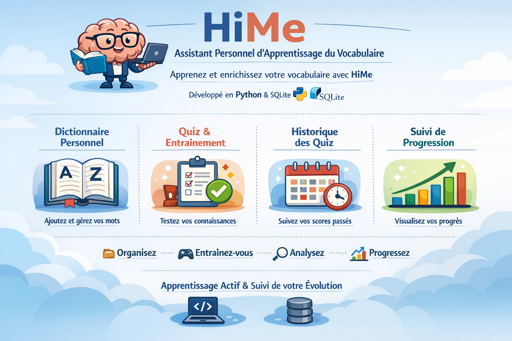

# 🧠 HiMe – Assistant personnel d’apprentissage du vocabulaire

  

## 📌 Présentation

HiMe est un projet personnel développé en **Python** avec **SQLite**, conçu pour accompagne et destiné à aider l’utilisateur dans l’apprentissage et l’enrichissement de son vocabulaire.

Le projet combine :

- gestion d’un dictionnaire personnel,

- entraînement par quiz "trois quiz",

- suivi des résultats et statistiques,

- stockage persistant des données.

## 📚 Organisation du vocabulaire

L’utilisateur organise son propre vocabulaire en ajoutant régulièrement les nouveaux mots et expressions qu’il apprend.
Ces éléments sont enregistrés afin de construire progressivement un dictionnaire personnel d’apprentissage.

## 🎮 Quiz et historique

À partir du vocabulaire enregistré, l’utilisateur peut réaliser des quiz personnalisés pour réviser ses connaissances.
Chaque session de quiz est automatiquement enregistrée dans un historique, permettant de consulter les scores et les dates des quiz passés.

## 📈 Progression

Le bloc Progression permet à l’utilisateur de visualiser son évolution dans le temps, en s’appuyant sur le nombre de mots enregistrés et les résultats des quiz, afin de suivre et analyser son apprentissage.

## 🎯 Objectif du projet

HiMe vise à **mettre l’utilisateur au centre de son propre apprentissage**, en le rendant acteur et responsable de sa progression.

- Le projet repose sur un apprentissage actif combinant :

- l’organisation du vocabulaire,

- la pratique régulière à travers des quiz,

- le suivi de l’historique des résultats,

- l’analyse de la progression dans le temps.

### Ce projet permet également de renforcer mes compétences en programmation Python et en gestion de bases de données.
